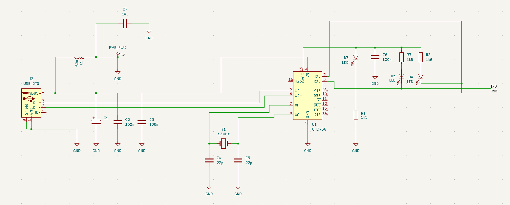
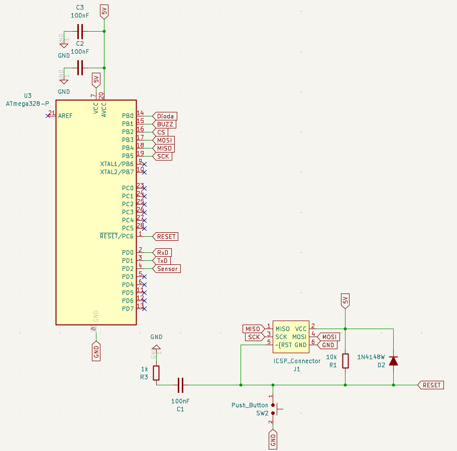
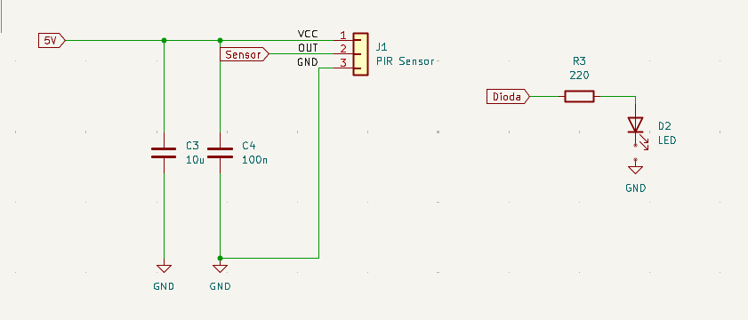
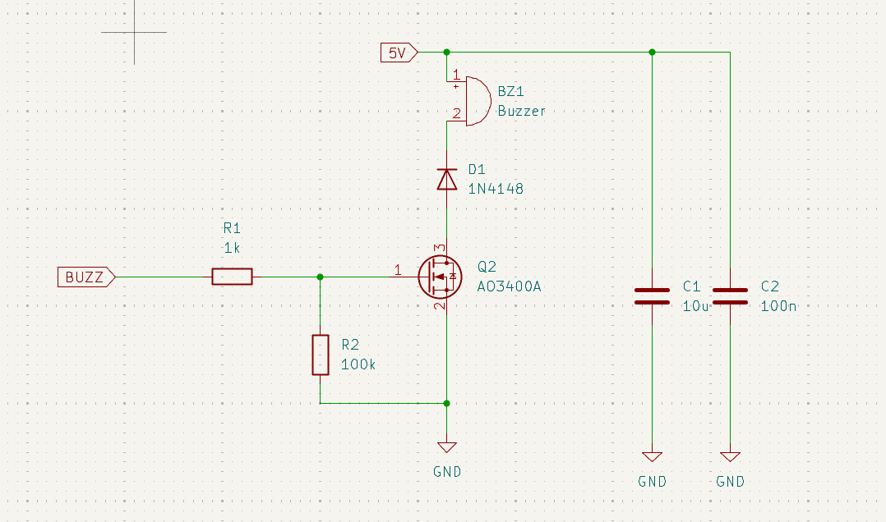
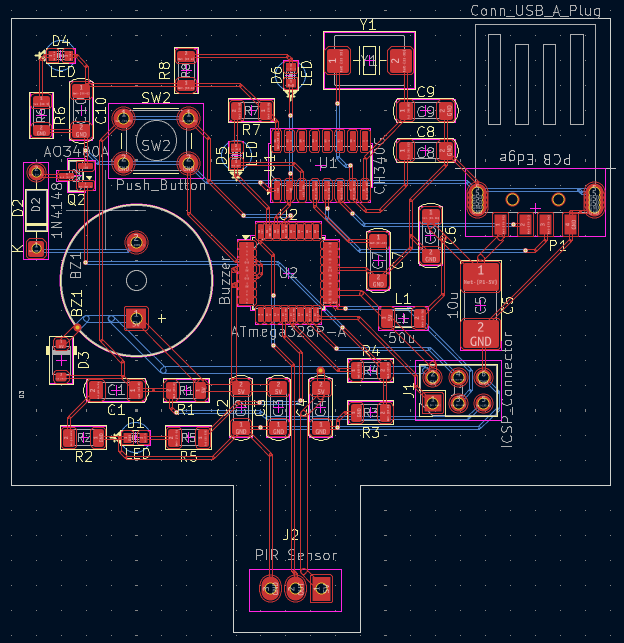

# Czujnik ruchu z alarmem
> Prosty system alarmowy oparty na platformie AVR ATmega, wykorzystujący czujnik ruchu PIR do wykrywania obecności i sygnalizacji zagrożenia.

## Spis treści
* [Informacje ogólne](#informacje-ogólne)
* [Użyte technologie](#użyte-technologie)
* [Funkcjonalności](#funkcjonalności)
* [Zrzuty ekranu](#zrzuty-ekranu)
* [Konfiguracja](#konfiguracja)
* [Instrukcja użycia](#instrukcja-użycia)
* [Status projektu](#status-projektu)
* [Możliwości rozwoju](#możliwości-rozwoju)
* [Podziękowania](#podziękowania)

## Informacje ogólne
- Projekt jest prostym systemem bezpieczeństwa.
- Jego głównym celem jest wykrywanie ruchu w monitorowanym obszarze i informowanie o tym za pomocą sygnałów dźwiękowych (buzzer) oraz świetlnych (diody LED/wyświetlacz).
- Projekt powstał w celach edukacyjnych, aby zademonstrować działanie czujników PIR we współpracy z mikrokontrolerami.

## Użyte technologie
- Arduino IDE - wersja 1.8+
- C (język oprogramowania Arduino i ATmega)
- Hardware: ATmega
- Hardware: Czujnik ruchu PIR (np. HC-SR501)
- Hardware: Buzzer (głośnik piezoelektryczny)
- Hardware: Diody LED / Wyświetlacz LCD (zależnie od wersji)

## Funkcjonalności
Główne funkcje projektu:
- Wykrywanie ruchu za pomocą czujnika podczerwieni.
- Aktywacja alarmu dźwiękowego po wykryciu intruza.
- Sygnalizacja wizualna stanu czuwania oraz stanu alarmowego.

## Zrzuty ekranu
- Schemat modułu zasilającego przez USB. 

- Schemat modułu mikroprocesora. 

- Schemat modułu czujnika. 

- Schemat modułu alarmu z buzzerem. 

- Schemat fizyczny PCB. 

- Mapa pinów ATMEGA328P. 

### Przypisanie pinów mikrokontrolera

| Pin    | Etykieta | Typ       | Opis funkcjonalny |
|--------|----------|-----------|-------------------|
| 1      | RESET    | Wejście   | Sygnał resetujący układ. Podciągnięty do VCC rezystorem 10 kΩ. Wykorzystywany manualnego restartu przyciskiem. |
| 30     | RXD      | I/O       | Port szeregowy UART (odbiornik). Służy do komunikacji z układem CH340G w celu programowania i diagnostyki. |
| 31     | TXD      | I/O       | Port szeregowy UART (nadajnik). Odpowiada za wysyłanie danych z mikrokontrolera do interfejsu USB. |
| 32     | Sensor   | Wejście   | Cyfrowe wejście sygnałowe z czujnika ruchu PIR. Stan wysoki informuje o wykryciu obiektu. |
| 4, 18  | VCC/AVCC | Zasilanie | Linie zasilania dodatniego +5 V. AVCC zasila dodatkowo blok przetwornika ADC. |
| 3, 21  | GND      | Zasilanie | Masa układu (0 V). Wspólny punkt odniesienia dla wszystkich sygnałów. |
| 12     | Dioda    | Wyjście   | Wyjście cyfrowe sterujące diodą sygnalizacyjną LED przez rezystor ograniczający prąd. |
| 13     | BUZZ     | Wyjście   | Wyjście sterujące bramką tranzystora MOSFET (kluczowanie buzzera). Umożliwia generowanie sygnałów akustycznych. |
| 15–17 | SPI      | I/O       | Interfejs komunikacyjny (MOSI, MISO, SCK) wyprowadzony na złącze ICSP, służący do programowania ISP. |

## Konfiguracja
Wymagania sprzętowe i programowe:
1. Zainstalowane środowisko AVR ATmega IDE.
2. Mikrokontroler ATmega i odpowiednie podzespoły.

**Instalacja:**
1. Sklonuj to repozytorium na swój dysk lokalny.
2. Otwórz plik projektu w Visual Studio Code.
3. Podłącz AVR do komputera przewodem USB.
4. Sprawdź w kodzie źródłowym, do których pinów należy podłączyć czujnik, diody i buzzer (zdefiniowane zwykle na początku pliku jako `#define` lub `const int`).
5. Wgraj wsad do mikrokontrolera za pomocą komendy "makefile" w środowisku Visual Studio.

## Instrukcja użycia
Jak korzystać z urządzenia:
1. Po podłączeniu zasilania, układ potrzebuje chwili na "kalibrację" czujnika PIR (zwykle od 30 do 60 sekund).
2. W stanie czuwania urządzenie nie wydaje dźwięków.
3. Po wykryciu ruchu w polu widzenia czujnika, uruchomi się alarm.

## Pliki kodu
**firmware/src**
- main.c jest odpowiedzialny za uzbrajanie, rozbrajanie, oraz efekty świetlne i dźwiękowe alarmu.
- timer.c służy do pilnowania poprawnego działania czasomierza.
- uart.c kontroluje przepływ danych pomiędzy pinami i wyświetla dany stan alarmu.
##
**firmware/inc**
- alarm.h zawiera zmienne stanu alarmu
- config.h zawiera zmienne dotyczące konfiguracji pinów
- timer.h definiuje czasomierz
- uart.h posiada zmienne dla wyświetlania tekstu

## Status projektu
Projekt jest: _w trakcie zakończenia. Przewidywany czas zakończenia 13.02.2026_.

## Możliwości rozwoju
Obszary, które można ulepszyć w przyszłości:
- Możliwość ulepszenia 1: Dodanie modułu GSM do wysyłania powiadomień SMS.
- Możliwość ulepszenia 2: Dodanie klawiatury do uzbrajania/rozbrajania alarmu kodem PIN.

Do zrobienia:
- Fizyczne przygotowanie mikrokontrolera

## Podziękowania
- Ten projekt był inspirowany standardowymi przykładami użycia czujnika HC-SR501.
- Podziękowania dla społeczności AVR za dokumentację bibliotek.

